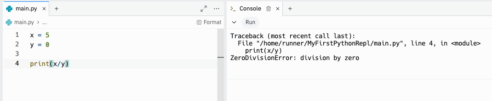

<h1>
  <span class="headline">Python Error Handling and Debugging</span>
  <span class="subhead">Error Handling and Debugging</span>
</h1>

**Learning objective:** By the end of this lesson, students will be able to identify common Python errors, interpret error messages to diagnose issues, and implement try/except blocks to handle errors effectively.

| Lesson                       | Duration |
| ---------------------------- | -------- |
| Error Handling and Debugging | 40 min   |

## Our Learning Goals

- Identify common errors in Python
- Read error messages for guidance to fix errors
- Implement try/except error handling


## Making Errors Into Friends

Python errors are very helpful and typically have clear messages.

- Errors sometimes say exactly what's wrong.
- Some errors have very common causes.
- Errors may say exactly how to fix the issue.

Once you've seen the same error a few times, you'll start to know exactly where to look to fix the problem.

> 💡 On the surface, errors are frustrating! However, they generally tell you what’s wrong so you can fix it! You will have a much better time programming if you learn to use error messages as a guide instead of a blocker.

<br>

<div class="activity discussion">
  <h2 class="title">Error Messages</h2>
  <span class="minutes"></span>
</div>

What's wrong with the code snippet below? What information is the error message giving us?



> 💡 Let’s dissect this error message. The error gives us the File and Line Number that caused the error, along with what type of error (ZeroDivisionError) and a brief description.

<br>

<div class="activity solo-exercise">
  <h2 class="title">8.1 Error Scavenger Hunt</h2>
  <span class="minutes">30 min</span>
</div>

We've curated a selection of the most common errors available in Python. Run each of the code blocks in the notebook, read the error message, then describe in your own words what the error type means.

> Tip: After completing this exercise, review each type of error you encountered. To deepen your understanding, try Googling the exact error message. This will show you how to find useful answers and resources online. Discussing these errors with your peers can also provide additional insights and help clarify any confusion.

## Program Errors vs. Logic Errors

| **Program Errors**                                                                    | **Logic Errors**                                                                                                                     |
| ------------------------------------------------------------------------------------- | ------------------------------------------------------------------------------------------------------------------------------------ |
| Program Errors are easy to spot. Your code won't run, and it will complain about why. | Logic Errors are tougher to track down. The code snippet below, while running error-free, is not doing what the programmer expected. |

```python
def multiply(num_1, num_2):
    return num_1 + num_2

hundred = multiply(10, 10)
# hundred is actually 20!
```

## Print Your Way to Freedom!

When debugging logic errors, `print()` statements at each step of the way can reveal where the program went wrong. You might add print statements to:

- Determine which blocks of code execute, and in what order
- Reveal the value of specific variables and parameters used
- Test out individual blocks of code to ensure they work as expected
